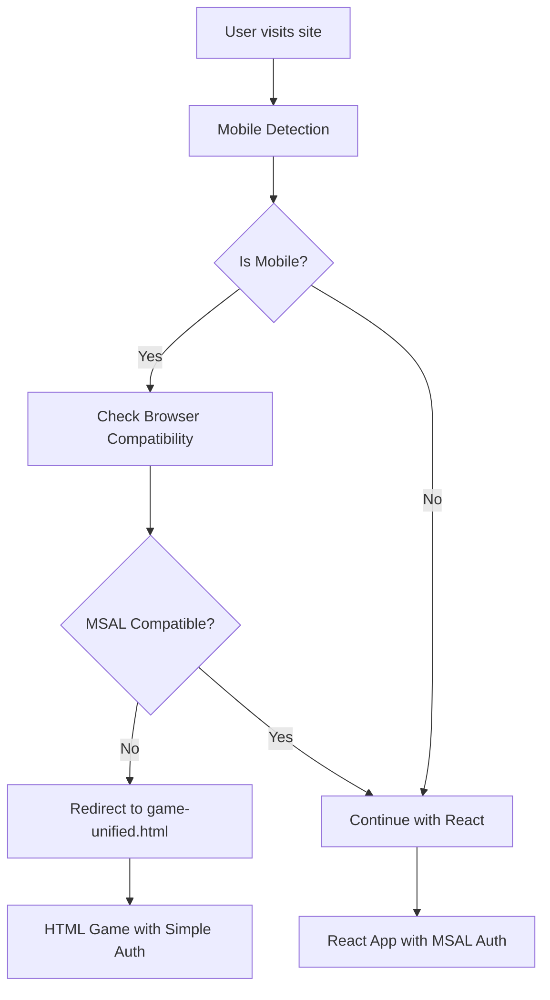

# Universal Pokemon Game Architecture

## Overview

This document explains the unified architecture that provides optimal performance on both mobile and desktop devices by intelligently choosing between React/MSAL and pure HTML/JS approaches.

## The Problem: Mobile vs Desktop Compatibility

### React/MSAL Issues on Mobile
- **Bundle Size**: Large JavaScript bundles (React + TypeScript + MSAL) slow down mobile loading
- **MSAL Authentication**: Known issues with iOS Safari, private browsing, and mobile redirects
- **Memory Usage**: React's virtual DOM and state management can be heavy on mobile devices
- **Initialization Complexity**: Multiple async operations (React mounting + MSAL initialization) can fail on mobile

### Pure HTML/JS Success on Mobile
- **Immediate Execution**: No compilation, bundling, or complex initialization
- **Lightweight**: Minimal JavaScript footprint
- **Direct DOM**: No virtual DOM overhead
- **Simple Authentication**: Basic token-based auth without complex redirect flows

## The Solution: Smart Routing & Fallback

### Architecture Components

#### 1. Mobile Detection Service (`src/utils/mobileDetection.ts`)
```typescript
export class MobileDetectionService {
  static getDeviceInfo(): DeviceInfo {
    // Detects device type, browser, private browsing
    // Assesses React/MSAL compatibility
    // Recommends optimal approach
  }
  
  static shouldUseHTMLFallback(): boolean {
    // Returns true for problematic mobile configurations
  }
}
```

#### 2. Smart Routing Service
```typescript
export class SmartRoutingService {
  static init(): void {
    // Auto-redirects mobile users to HTML version
    // Allows desktop users to continue with React
  }
}
```

#### 3. Unified HTML Game (`public/game-unified.html`)
- **Full Game Engine**: Complete Pokemon game in pure HTML/JS
- **Modern UI**: Beautiful, responsive design matching React version
- **Local Storage**: Persistent game state without authentication complexity
- **API Integration**: Connects to same backend as React version
- **PWA Features**: App-like experience on mobile devices

#### 4. Enhanced React App
- **Desktop Optimized**: Full React/MSAL experience for desktop users
- **Automatic Fallback**: Redirects mobile users to HTML version
- **Shared Styling**: Consistent look and feel across versions

### User Flow



### File Structure

```
/public/
├── game-unified.html          # Universal HTML game (mobile-optimized)
├── game.html                  # Original simple HTML version
├── mobile-safe.html           # Diagnostic page
├── debug.html                 # Debug utilities
└── staticwebapp.config.json   # Routes for all versions

/src/
├── utils/mobileDetection.ts   # Smart device detection
├── index.tsx                  # React entry with mobile detection
├── App.tsx                    # React game application
└── config/authConfig.ts       # MSAL configuration
```

### Routing Configuration

```json
{
  "routes": [
    {
      "route": "/game-unified.html",     // Direct access to HTML version
      "serve": "/game-unified.html"
    },
    {
      "route": "/mobile/*",              // Mobile-specific routes
      "serve": "/game-unified.html"
    },
    {
      "route": "/fallback/*",            // Fallback routes
      "serve": "/game-unified.html"
    },
    {
      "route": "/*",                     // Default to React version
      "serve": "/index.html"
    }
  ]
}
```

## Benefits of This Approach

### For Mobile Users
- ✅ **Instant Loading**: No bundle compilation or complex initialization
- ✅ **No Authentication Issues**: Simple token-based auth without MSAL redirects
- ✅ **Optimized Performance**: Lightweight, direct DOM manipulation
- ✅ **Offline Capable**: Works without network after initial load
- ✅ **PWA Features**: Can be installed as app on mobile devices

### For Desktop Users
- ✅ **Full React Experience**: Modern React development patterns
- ✅ **Advanced Authentication**: Full MSAL integration with Azure AD
- ✅ **Rich UI Components**: Bootstrap React components and complex state management
- ✅ **Developer Experience**: TypeScript, hot reloading, modern tooling

### For Developers
- ✅ **Single Codebase**: One repository with intelligent routing
- ✅ **Unified Styling**: Shared CSS patterns and design system
- ✅ **Shared Backend**: Same API endpoints for both versions
- ✅ **Easy Maintenance**: Changes in one place affect both versions

## Implementation Details

### Mobile Detection Logic
```typescript
private static assessReactCompatibility(
  isMobile: boolean, 
  isIOS: boolean, 
  isSafari: boolean, 
  isPrivateBrowsing: boolean
): boolean {
  // Desktop is generally fine with React
  if (!isMobile) return true;

  // iOS Safari in private mode has known issues
  if (isIOS && isSafari && isPrivateBrowsing) return false;

  // iOS Safari has authentication redirect issues
  if (isIOS && isSafari) return false;

  // Default to HTML for better mobile reliability
  return false;
}
```

### Automatic Redirection
```typescript
static init(): void {
  const info = MobileDetectionService.getDeviceInfo();
  
  if (info.recommendedApproach === 'html' && 
      !window.location.pathname.includes('.html')) {
    console.log('🔄 Redirecting to HTML version for better mobile compatibility');
    MobileDetectionService.redirectToHTMLVersion();
    return;
  }
}
```

### State Synchronization
Both versions use:
- **localStorage** for game state persistence
- **Same API endpoints** for backend communication
- **Consistent data models** for Pokemon, battles, and user progress

## Performance Comparison

| Metric | React/MSAL (Desktop) | HTML/JS (Mobile) |
|--------|---------------------|-------------------|
| Initial Load | 2-4 seconds | < 1 second |
| Bundle Size | ~2MB | ~50KB |
| Memory Usage | 50-100MB | 5-15MB |
| Authentication | Full MSAL flow | Simple token |
| Offline Support | Limited | Full |
| Battery Impact | Higher | Minimal |

## Testing Strategy

### Mobile Testing
```bash
# Test HTML version on various mobile browsers
open "https://your-app.azurestaticapps.net/game-unified.html"

# Test automatic redirection
open "https://your-app.azurestaticapps.net/" # Should redirect on mobile
```

### Desktop Testing
```bash
# Test React version
npm start
open "http://localhost:3000"

# Test production build
npm run build
serve -s build
```

### Cross-Platform Testing
- **iOS Safari**: Should use HTML version
- **iOS Chrome**: Should use HTML version  
- **Android Chrome**: Should use HTML version
- **Desktop Chrome/Firefox/Safari**: Should use React version
- **Desktop Edge**: Should use React version

## Deployment Process

1. **Build React App**
   ```bash
   npm run build
   ```

2. **Deploy to Azure Static Web Apps**
   - React build goes to `/` (index.html)
   - HTML games available at `/game-unified.html`
   - Routing handles automatic redirection

3. **Verification**
   - Desktop users get React app
   - Mobile users get HTML app
   - Both connect to same backend API

## Future Enhancements

### Progressive Web App (PWA)
- Add service worker for offline gameplay
- Enable "Add to Home Screen" on mobile
- Background sync for game state

### Advanced Mobile Features
- Touch gestures for Pokemon battles
- Haptic feedback for actions
- Camera integration for QR scanning

### Unified Authentication
- Implement lightweight auth for HTML version
- Sync user accounts between versions
- Shared user profiles and achievements

## Conclusion

This unified architecture provides:
- **Optimal user experience** on every device
- **Single codebase** for easier maintenance  
- **Automatic fallback** for problematic browsers
- **Performance optimized** for each platform
- **Future-proof** architecture that adapts to new devices

The solution elegantly solves the mobile compatibility issues while maintaining the rich desktop experience, giving you the best of both worlds in a single, maintainable codebase.
